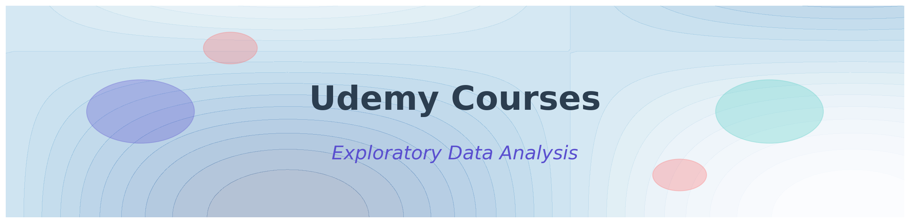
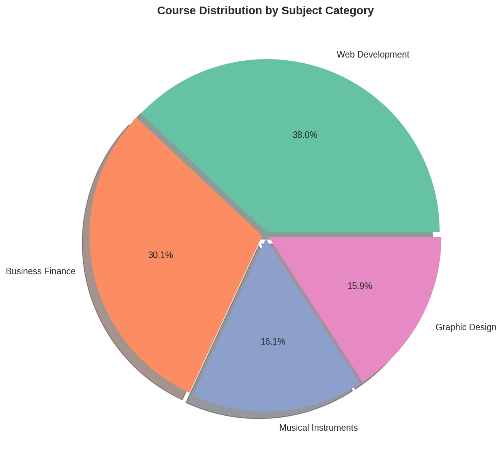
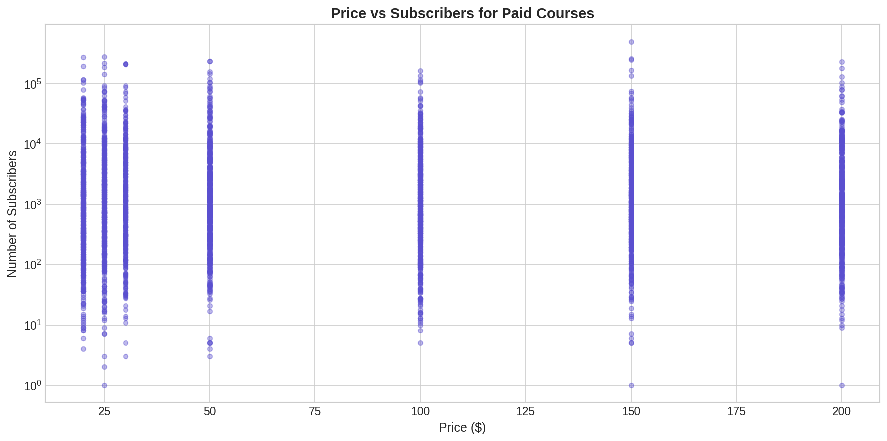
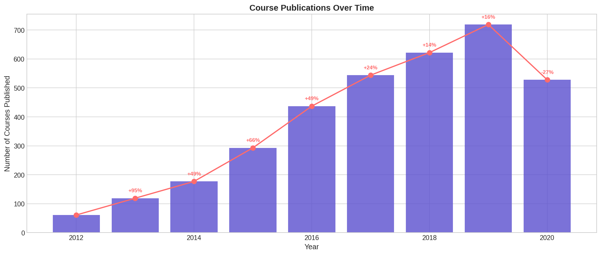
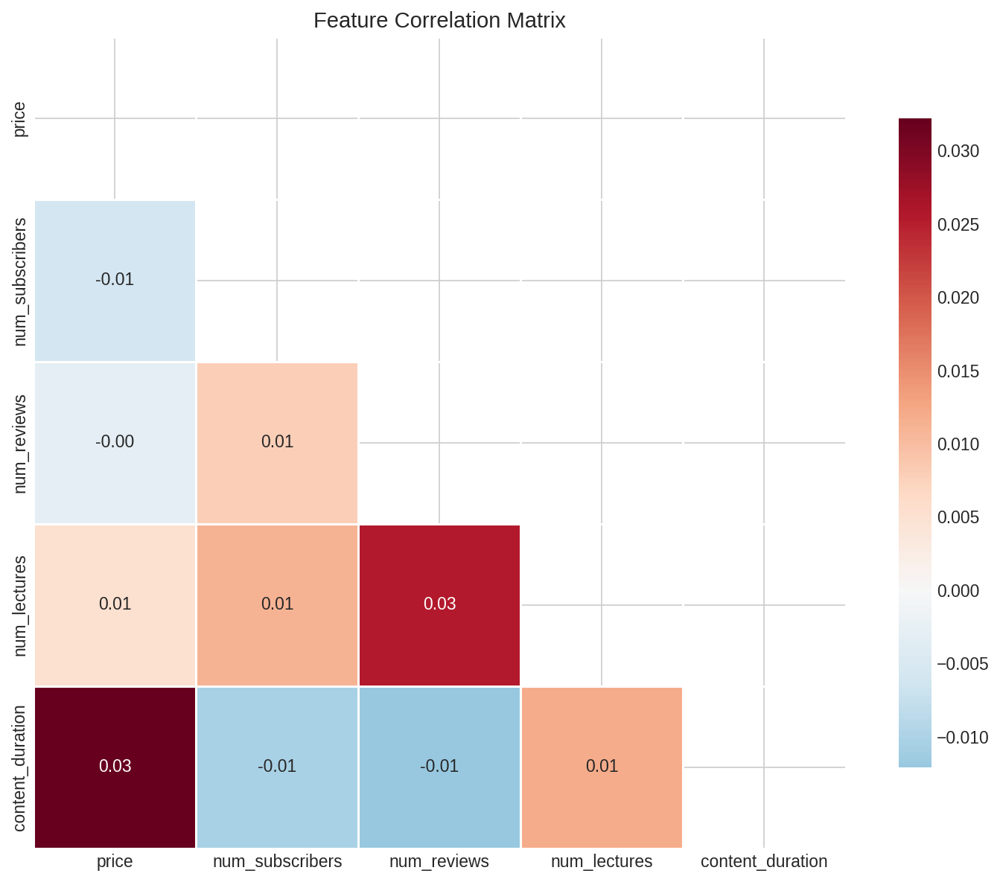
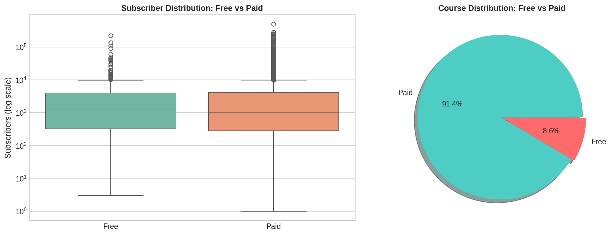

# Udemy Courses: Exploratory Data Analysis

<p align="center">
  
</p>

[](https://python.org)
[](https://jupyter.org)
[](LICENSE)
[](https://www.kaggle.com/andrewmvd/udemy-courses)

An in-depth exploratory data analysis of Udemy's online course catalog, investigating patterns in course distribution, pricing strategies, subscriber engagement, and temporal trends in the online education market.

## Overview

This project analyzes **3,682 courses** across four major subjects (Web Development, Business Finance, Graphic Design, Musical Instruments) to uncover insights about the dynamics of online education platforms. The analysis employs statistical methods and visualization techniques to identify factors associated with course popularity and learner engagement.

### Key Findings

| Metric | Value |
|--------|-------|
| Total Courses Analyzed | 3,682 |
| Total Subscribers | 11.9M+ |
| Median Course Price | $50 |
| Free Course Percentage | ~8.4% |
| Top Subject (by subscribers) | Web Development |

**Notable Insights:**
- Price shows **weak correlation** (ρ ≈ 0.05) with subscriber count
- Web Development courses capture **3.4x more subscribers per course** than Business Finance
- Course publication rates **increased 400%** between 2013-2016
- Free courses exhibit distinct engagement patterns despite representing only 8% of catalog

## Project Structure

```
udemy-eda-project/
├── data/
│   ├── udemy_courses.csv          # Raw dataset
│   └── README.md                  # Dataset documentation
├── notebooks/
│   └── udemy_eda.ipynb            # Main analysis notebook
├── figures/
│   ├── banner.png
│   ├── correlation_matrix.png
│   ├── subject_distribution.png
│   ├── price_vs_subscribers.png
│   ├── yearly_trend.png
│   └── ...
├── src/
│   ├── __init__.py
│   ├── utils.py                   # Helper functions
│   └── generate_figures.py        # Visualization script
├── requirements.txt
├── LICENSE
└── README.md
```

## Dataset

**Source:** [Kaggle - Udemy Courses](https://www.kaggle.com/andrewmvd/udemy-courses)

| Feature | Description | Type |
|---------|-------------|------|
| `course_id` | Unique identifier | int |
| `course_title` | Course name | str |
| `url` | Course URL | str |
| `is_paid` | Payment status | bool |
| `price` | Course price (USD) | float |
| `num_subscribers` | Subscriber count | int |
| `num_reviews` | Review count | int |
| `num_lectures` | Number of lectures | int |
| `level` | Difficulty level | str |
| `content_duration` | Course length (hours) | float |
| `published_timestamp` | Publication date | datetime |
| `subject` | Course category | str |

## Methodology

### 1. Data Cleaning
- Missing value analysis and imputation
- Duplicate detection and removal
- Data type conversion and validation

### 2. Feature Engineering
- Temporal feature extraction (year, month, day of week)
- Engagement metrics computation (reviews per subscriber)
- Revenue estimation for paid courses

### 3. Analysis Dimensions
- **Univariate**: Distribution analysis of numerical and categorical features
- **Bivariate**: Correlation analysis, cross-tabulations
- **Temporal**: Publication trends, seasonal patterns
- **Comparative**: Free vs. paid, subject-level comparisons

## Results

### Subject Distribution

<p align="center">
  
</p>

Web Development and Business Finance dominate the platform with nearly equal course counts, but Web Development generates significantly higher subscriber engagement.

### Price-Subscriber Relationship

<p align="center">
  
</p>

The weak correlation between price and subscribers suggests that course quality signals (reviews, instructor reputation) outweigh price sensitivity in purchase decisions.

### Temporal Growth

<p align="center">
  
</p>

Platform growth accelerated significantly post-2013, coinciding with mobile app launches and Series C funding.

### Correlation Matrix

<p align="center">
  
</p>

### Free vs Paid Courses

<p align="center">
  
</p>

## Quick Start

### Prerequisites

```bash
Python >= 3.8
pip >= 21.0
```

### Installation

```bash
# Clone the repository
git clone https://github.com/tharun-ship-it/udemy-eda-project.git
cd udemy-eda-project

# Create virtual environment (recommended)
python -m venv venv
source venv/bin/activate  # On Windows: venv\Scripts\activate

# Install dependencies
pip install -r requirements.txt
```

### Running the Analysis

```bash
# Launch Jupyter Notebook
jupyter notebook notebooks/udemy_eda.ipynb
```

Or run directly:

```bash
cd notebooks
jupyter nbconvert --execute --to notebook udemy_eda.ipynb
```

## Dependencies

```
numpy>=1.19.0
pandas>=1.2.0
matplotlib>=3.3.0
seaborn>=0.11.0
jupyter>=1.0.0
```

## Live Demo

Run this notebook instantly in your browser - no installation required!

[](https://colab.research.google.com/github/tharun-ship-it/udemy-eda-project/blob/main/notebooks/udemy_eda.ipynb)
[](https://mybinder.org/v2/gh/tharun-ship-it/udemy-eda-project/main?labpath=notebooks%2Fudemy_eda.ipynb)

> **Note:** Google Colab allows anyone to view and execute the notebook directly in the browser, making it perfect for portfolio demonstrations.

## Future Work

- [ ] Sentiment analysis of course reviews
- [ ] Predictive modeling for subscriber count
- [ ] Time series forecasting for course publications
- [ ] NLP analysis of course titles and descriptions
- [ ] Integration with additional datasets (instructor info, ratings over time)

## Contributing

Contributions are welcome! Please feel free to submit a Pull Request. For major changes, please open an issue first to discuss what you would like to change.

1. Fork the repository
2. Create your feature branch (`git checkout -b feature/AmazingFeature`)
3. Commit your changes (`git commit -m 'Add some AmazingFeature'`)
4. Push to the branch (`git push origin feature/AmazingFeature`)
5. Open a Pull Request

## License

This project is licensed under the MIT License - see the [LICENSE](LICENSE) file for details.

## Acknowledgments

- Dataset provided by [Larxel](https://www.kaggle.com/andrewmvd) on Kaggle
- Visualization inspiration from [Seaborn Gallery](https://seaborn.pydata.org/examples/index.html)

## Contact

👤 **Tharun Ponnam**
- GitHub: [@tharun-ship-it](https://github.com/tharun-ship-it)
- Email: [tharunponnam007@gmail.com](mailto:tharunponnam007@gmail.com)

Project Link: [https://github.com/tharun-ship-it/udemy-eda-project](https://github.com/tharun-ship-it/udemy-eda-project)

---

<p align="center">
  <i>If you found this analysis useful, please consider giving it a ⭐</i>
</p>
